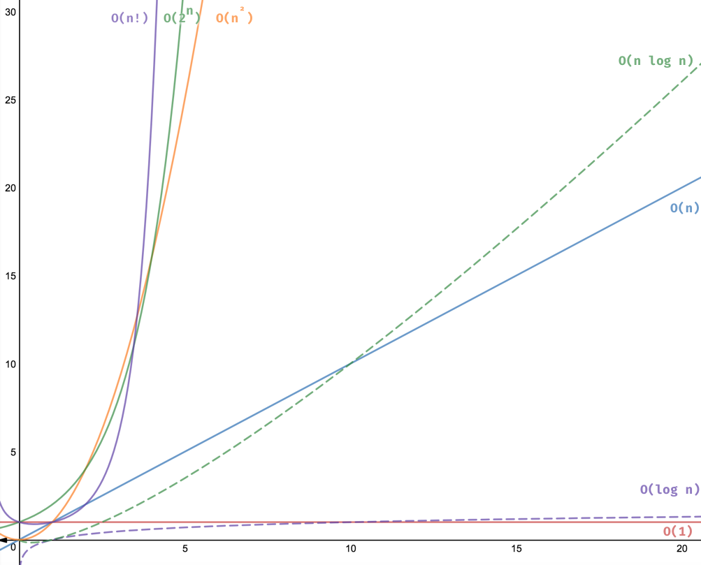

# Time and Space Complexity

Time and space complexity are the two main measures for calculating algorithm efficiency. 

# Time Complexity / Order of Growth

Time complexity is a measure of the amount of time an algorithm or program takes to complete as a function of its input size. It is an important concept for analyzing and comparing the performance of different algorithms or implementations.

The Time Complexity of an algorithm/code is not equal to the actual time required to execute a particular code, but the number of times a statement executes.

# Big O Notation

Time complexity is often expressed using Big O notation. Big O notation is used to describe the upper bound of the time complexity of an algorithm. It provides an estimate of how the runtime of an algorithm will grow as the input size grows.

In Big O notation, we ignore constant factors and lower-order terms and focus only on the dominant term or terms that grow the fastest as the input size increases. 

## Most Common Time Complexities

### Constant Time Complexity `O(1)` 

The runtime of the algorithm is constant, independent of the input size.

### Linear Time Complexity `O(n)`

The runtime of the algorithm grows linearly with the input size.

### Logarithmic Time Complexity `O(log n)`

The runtime of the algorithm grows logarithmically with the input size.

When we keep dividing or multiplying the size of input `N` by some value, say `b`. Then the Time Complexity turns out to be `log(N)` to the base `b`

> In Big-O complexity analysis, it doesn't actually matter what the logarithm base is. (they are asymptotically the same, i.e. they differ by only a constant factor): `O(log2 N) = O(log10 N) = O(loge N)`

### Log-Linear Time Complexity `O(n log n)`

The runtime of the algorithm grows almost linearly with the input size, but with a logarithmic factor.

When we call a Logarithmic Time Algorithm inside a loop, it would result into a Log-Linear Time Complexity program.

### Polynomial Time Complexity `O(n^c)`

- When the computation time increases as function of N raised to some power, N being the size of input. 

- For example, let’s say we have a list of size N and we have nested loops on that list. Such a code has O(N^2) (quadratic time complexity) time complexity.

- This is common with algorithms that involve nested iterations over the data. Deeper nested iterations will result in O(N3), O(N4) etc.

### Exponential Time Complexity `O(c^n)`

- The runtime of the algorithm grows exponentially with the input size.

- For example, the recursive code to find Nth fibonacci number has Time Complexity as O(2^N)

### Factorial Time `O(n!)`

- The runtime of the algorithm grows factorially with the input size.

- We will find ourselves writing algorithms with factorial time complexity when calculating permutations and combinations.

- Examples of O(n!) factorial runtime algorithms:
    - Permutations of a string.

--------------------------------------

### Big O Complexity Chart

- O(1) - Excellent/Best
- O(log n) - Good
- O(n) - Fair
- O(n log n) - Bad
- O(n^2), O(n^3), O(2^n) and O(n!) - Horrible/Worst (Never use it!!)

--------------------------------

# Big O, Big Omega `Ω`, and Big Theta `Θ`Notation

When analyzing the time complexity of an algorithm, we often use three notations: O, Θ, and Ω. These notations describe different aspects of the algorithm's behavior and provide different levels of information about its performance.

### O-notation (worst-case time complexity): 

The O-notation describes an **upper bound** on the growth rate of the algorithm's running time, in terms of the input size. It represents the worst-case time complexity of the algorithm, which is the maximum amount of time the algorithm can take to complete its task. 

### Θ-notation (average-case time complexity)

The Θ-notation describes an average-case bound on the growth rate of the algorithm's running time, in terms of the input size. It represents the average amount of time the algorithm takes to complete its task, over all possible inputs of size n. 

### Ω-notation (best-case time complexity)

The Ω-notation describes a **lower bound** on the growth rate of the algorithm's running time, in terms of the input size. It represents the best-case time complexity of the algorithm, which is the minimum amount of time the algorithm can take to complete its task.

**In summary,** O-notation describes the upper bound, Ω-notation describes the lower bound, and Θ-notation describes the tight bound (both upper and lower bound) on the algorithm's running time. By using these notations, we can get a better understanding of the behavior and performance of an algorithm for different input sizes.

--------------------------------