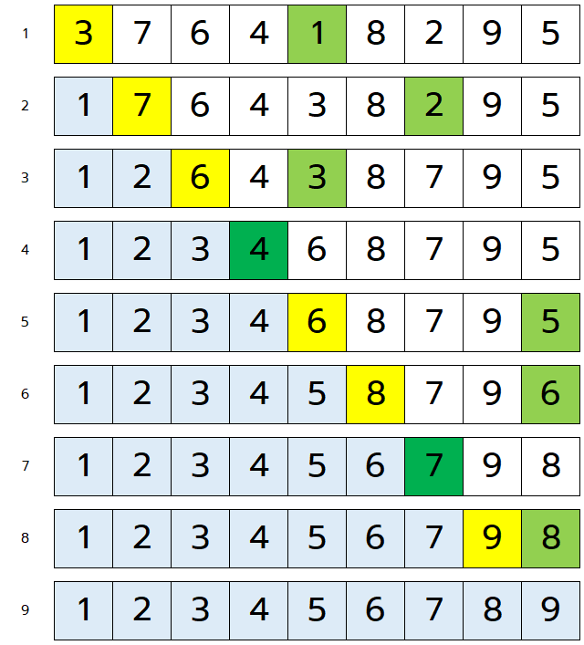
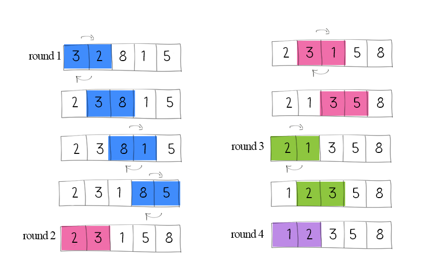
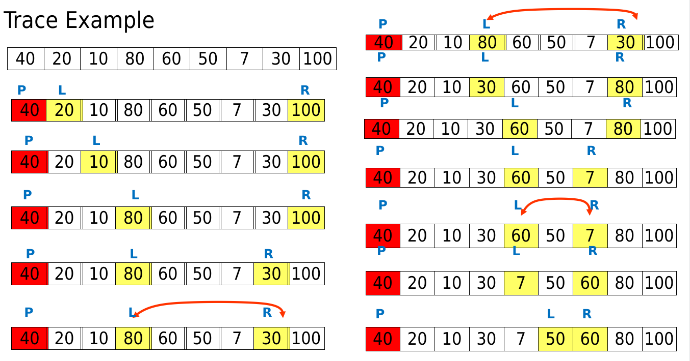
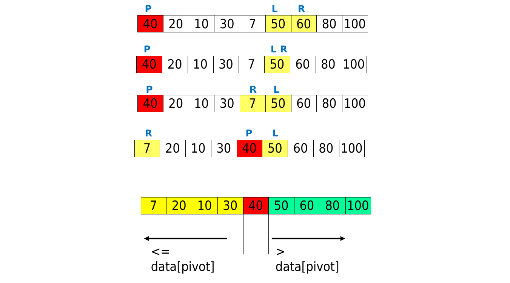
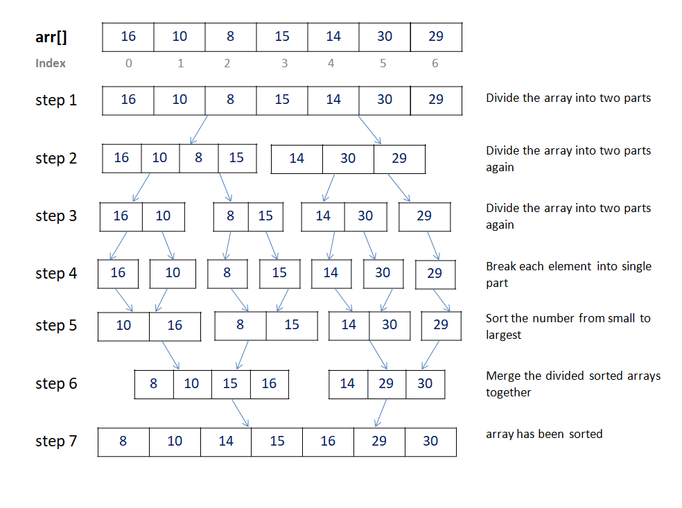
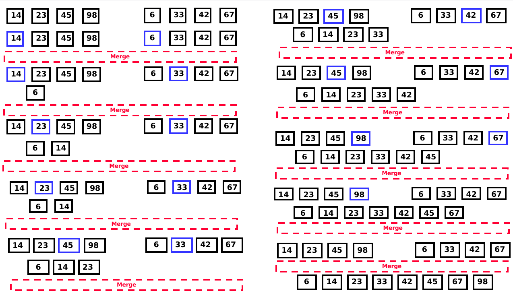

# Sorting Algorithms

Sorting algorithms are algorithms that put elements of a list or array in a certain order. 

There are many different sorting algorithms, each with its own advantages and disadvantages, depending on the type of data being sorted and the desired performance characteristics. 
 
# Some of the most commonly used sorting algorithms include:

# Insertion Sort `O(N^2)`

This algorithm works by iterating through an array and inserting each element in its proper place (repeatedly swap the element with the one to its left if smaller.)


### Idea for sorting: Sorting a Hand of Cards

- Pick up one card at a time from the unsorted portion of the deck
- Insert the card into its correct position in the sorted portion of the deck
- Repeat until all cards have been sorted


### Analysis of Insertion Sort

#### Best case : `O(N)`

The best case for Insertion Sort is when the input array is already sorted. In this case, the algorithm only needs to make `N-1` comparisons and no swaps.

#### Worst case: `O(N^2)`

The worst case for Insertion Sort is when the input array is sorted in **reverse order**. 

#### Expected case: `O(N^2)`


### Advantages and Disadvantages of Insertion Sort

**Advantages:**

- Simple and easy to understand and implement.
- Efficient for small data sets or partially sorted data.

**Disadvantages:**

- Inefficient for large data sets or completely unsorted data.
- Not suitable for use in parallel computing environments.
- Has a quadratic worst-case time complexity.

--------------------------------------------

# Selection Sort `O(N^2)`

This algorithm sorts an array by repeatedly finding the minimum element from the unsorted part of the array and putting it at the beginning.



### Analysis of Selection Sort

#### Best case : `O(N^2)`

The best case for selection sort occurs when the input array is already sorted. In this case, the algorithm will still perform `n^2` comparisons but no swaps will be needed.

#### Worst case: `O(N^2)`

The worst case for selection sort occurs when the input array is sorted in reverse order. In this case, the algorithm will perform `n^2` comparisons and `n` swaps.

#### Expected case: `O(N^2)`

The average case for selection sort occurs when the input array is unsorted or has some degree of randomness. In this case, the algorithm will perform `n^2` comparisons and `n` swaps on average.


### Advantages and Disadvantages of Selection Sort

**Advantages:**

- Simple and easy to understand and implement.
- Efficient for small data sets or partially sorted data.
- Memory Efficiency: Selection sort is an in-place sorting algorithm, meaning it doesn't require any extra memory space for sorting.


**Disadvantages:**

- Inefficient for large data sets or completely unsorted data.
- Not suitable for use in parallel computing environments.
- Not Adaptive. The running time of an adaptive algorithm depends on the initial order of the input, but selection sort always takes the same time to sort a given array, regardless of the input's initial order.
- Not suitable for complex data types: Selection sort can only sort simple data types such as integers and floating-point numbers. For complex data types, such as strings, objects, or arrays, a more advanced sorting algorithm is needed.

--------------------------------------------

# Bubble Sort `O(N^2)`

Bubble sort is a simple sorting algorithm that works by repeatedly swapping adjacent elements if they are in the wrong order. The algorithm iterates through the array multiple times, with each iteration sorting one more element into its correct position. The name "bubble" comes from the way that larger elements "bubble up" to the end of the array.



### Analysis of Bubble Sort

#### Best case: `O(N)`

The best case for bubble sort occurs when the input array is already sorted. In this case, the algorithm will only perform one pass through the array, making `n-1` comparisons and no swaps.

#### Worst case: `O(N^2)`

The worst case for bubble sort occurs when the input array is sorted in reverse order. In this case, the algorithm will perform `n*(n-1)/2` comparisons and `n*(n-1)/2` swaps.

#### Expected case: `O(N^2)`

The expected case for bubble sort occurs when the input array is unsorted or has some degree of randomness. In this case, the algorithm will perform `n*(n-1)/2` comparisons and `n*(n-1)/4` swaps on average.

### Advantages and Disadvantages of Bubble Sort

**Advantages:**

- Simple to understand and easy to implement.
- Bubble Sort is an in-place sorting algorithm, which means it requires very little additional memory to operate, making it very efficient for large data sets.

**Disadvantages:**

- Has a worst-case time complexity of `O(n^2)`, making it inefficient for large datasets.
- Bubble Sort is not adaptive, meaning that the algorithm does not take advantage of pre-existing order in the input array.

--------------------------------------------

# Quick Sort `O(N log N)`

This algorithm chooses a "pivot" element from the array, partitions the array into elements smaller and larger than the pivot, and then recursively sorts the smaller and larger partitions.

### Idea for partitioning: Cards on a table

- Choose a pivot card
- Place all cards smaller than the pivot to the left of the pivot
- Place all cards larger than the pivot to the right of the pivot
- Repeat the process on the left and right partitions





### Analysis of Quick Sort

```
Divide: Partition the array around a pivot element
Conquer: Recursively sort 2 subarrays
Combine: Trivial - nothing to do 
Analysis: T(N) = O(Divide & Combine) + T(Conquer)
T(N) = T(L) + T(N – L) + Θ(N) --> L: length of one of the two subarrays
```

**Divide:** The divide step selects a pivot element and partitions the array into two sub-arrays around the pivot element. The pivot selection can be done in different ways. The simplest way is to select the first or last element as the pivot, which takes `O(1)` time. The partitioning step takes `O(N)` time in the worst case.

**Conquer:** The conquer step recursively sorts the two sub-arrays created by the partition. The running time of the conquer step is `T(L) + T(N – L)`, where `L` is the length of one of the two sub-arrays.

**Combine:** The combine step is trivial, as the sub-arrays are already sorted after the conquer step, and there is nothing to do. Therefore, the running time of the combine step is `O(1)`.

#### Best case : `O(N log(N))`

The best case for QuickSort is when the pivot element divides the array into two subarrays of equal size (balanced tree). This happens when the pivot is the median of the array.

```
T(N) = 2 T(N/2) + Θ(N)
Master Case#2: Θ(N log(N))
```

#### Worst case: `O(N^2)`

The worst case for QuickSort is when the selected pivot is either the smallest or the largest element in the array. In this scenario, the partitioning process splits the array into two subarrays of sizes n-1 and 0. The algorithm then recursively sorts the subarray of size n-1.

This happens when the array is :
  - Sorted
  - Reverse sorted
  - Nearly sorted
  - Random
  - or if all the elements in the array are the same

```
T(N) = T(N – 1) + Θ(N)
Iteration/tree method : Θ(N^2)
```

#### Expected case: `O(N log(N))`

Ex.: Each call to Partition splits array into 9-to-1 proportional split


### Advantages and Disadvantages of Quick Sort

**Advantages:**

- Quick Sort is an in-place sorting algorithm, which means it requires very little additional memory to operate, making it very efficient for large data sets.

- It has an average time complexity of` O(n log n)`, which is faster than many other sorting algorithms.

- Can be easily parallelized, making it suitable for use in parallel computing environments such as multi-core processors or distributed systems.

**Disadvantages:**

- Randomness, meaning that the choice of pivot element affects the efficiency of the algorithm. Choosing a bad pivot can lead to worst-case time complexity. However, good pivot selection strategies can mitigate this problem.

- Not stable, meaning that the relative order of elements with equal values is not preserved.

- Not adaptive, meaning that the algorithm does not take advantage of pre-existing order in the input array.

### How to Avoid `N^2` Worst Case?

- You can shuffle the input array randomly in `Θ(N)` time before sorting it.

Or

- You can try choosing a good pivot. This could involve selecting:

  - The element in the middle position
  - Median of first, last, and middle :
    - For example, if we have [5, 10, 15, 20, 25], the median of the three values (5, 15, 25) is 15 = pivot.
  - Median of k sampled elements
  - A random element
    - Instead of always choosing the first or last element as the pivot, we can select a random element in each step
    - By selecting a random pivot instead of always choosing the first or last element, you can avoid worst-case scenarios when dealing with a completely sorted list, so the expected time is `O(N Log(N))` for ALL input arrays. 

--------------------------------------------------------------------

# Merge Sort `O(N log N)`

This algorithm divides an array into two halves, sorts each half recursively, and then merges the sorted halves into a single, sorted array.



### Idea for merging: Two piles of sorted cards

- Choose the smaller of the two top cards
- Remove it and place it in the output pile
- Repeat the process until one pile is empty
- Take the remaining input pile and place it face-down onto the output pile




### Analysis of Merge-Sort

```
Divide: Split into two halves
Conquer: Recursively sort 2 subarrays (2 halves)
Combine: Merge two sorted subarrays
Analysis: T(N) = O(Divide & Combine) + T(Conquer)
T(N) = 2 T(N/2) + Θ(N)
Master Case#2: Θ(N log(N))
```

- **Divide:** The divide step just computes the middle of the sub-array, which takes constant time `O(1)`.
- **Conquer:** Sort two problems of size `(n/2)`, running time= `2 T(n/2)`  
- **Combine:** MERGE n-element takes time `Θ(n)`

#### Best case : `O(N log(N))`

The best case for MergeSort is when the input array is already sorted. In this case, the algorithm would still perform the merge operation but wouldn't need to perform any comparisons during the merging process.

#### Worst case: `O(N log(N))`

The worst case for MergeSort is when the input array is in reverse order. In this case, the algorithm needs to perform maximum possible comparisons and merging operations

#### Expected case: `O(N log(N))`

### Advantages and Disadvantages of Merge Sort

**Advantages:**

- Guaranteed to run in `O(n log n)`
- Can be easily parallelized, making it suitable for use in parallel computing environments such as multi-core processors or distributed systems.

**Disadvantage:**

- Space complexity: requires extra space `O(N)` to store the temporary array
  - Can be reduced to `N/2` by moving the FIRST half into a new array of size `N/2`  while keeping the SECOND half in the original array.Then merge both into the original array.

----------------------------------------------------------

# Summary of Sorting Algorithms

|Algorithm     |Best case   |Average case|Worst case  |Space Complexity|
|:-------------|:-----------|:-----------|:-----------|:---------------|
|Bubble sort   |`O(n) `     |`O(n^2)`    |`O(n^2)`    |`O(1)`          |
|Insertion sort|`O(n) `     |`O(n^2)`    |`O(n^2)`    |`O(1)`          |
|Selection sort|`O(n^2)`    |`O(n^2)`    |`O(n^2)`    |`O(1)`          |
|Quick sort    |`O(n log n)`|`O(n log n)`|`O(n2)`     |`O(1)`          |
|Merge sort    |`O(n log n)`|`O(n log n)`|`O(n log n)`|`O(n)`          |


|Sorting Algorithm|Best Use Cases|
|-----------------|--------------|
|Selection Sort	  |Small arrays or when memory is a concern (it makes the minimum possible number of swaps during sorting)|
|Insertion Sort	  |Small arrays or when the input is almost sorted|
|Bubble Sort	    |Small arrays or when the input is almost sorted|
|Merge Sort	      |Large arrays and the memory space is not a constraint|
|Quick Sort	      |Large arrays or when an in-place sort is needed (effective for datasets that **fit** in memory)|


------------------------------------

These are just a few examples of the many different sorting algorithms that exist. Choosing the right sorting algorithm for a particular task depends on factors such as the size of the data set, the distribution of values, and the desired performance characteristics.

---------------------------------------------
---------------------------------------------

# Select Suitable Sort

### 1. Sort a file of huge records with tiny keys

- Application: 
  - Reorganize your MP-3 files)

**Since huge records --> Need to minimize # of swaps**

- **Insertion sort or bubble sort?**
  - NO, too many exchanges
- **Selection sort?**
  - YES, it takes linear time for exchanges 
- **Quick/Merge sort?**
  - Probably not: selection sort simpler, does less swaps

### 2. Sort a huge randomly-ordered file of small records

- Application: 
  - Process transaction record for a phone company)

**Since huge # of small record --> Need to minimize complexity**

- **Selection sort?**
  - NO, always takes quadratic time
- **Bubble sort?**
  - NO, quadratic time for randomly-ordered keys
- **Insertion sort?**
  - NO, quadratic time for randomly-ordered keys
- **Mergesort?**
  - YES, it is designed for this problem (specially for small RAM: can be easily parallelized and work on each part separately – need not to load the entire data in RAM)
- **Quicksort?**
  - YES, if large RAM


### 3. Sort a file that is already almost in order

- Applications:
  - Re-sort a huge database after a few changes
  - Double-check that someone else sorted a file

- **Selection sort?**
  - NO, always takes quadratic time
- **Bubble sort?**
  - NO, bad for some definitions of “almost in order”
  - Ex: B C D E F G H I J K L M N O P Q R S T U V W X Y Z A
- **Insertion sort?**
  - YES, takes linear time for most definitions of “almost in order”
- **Quick/Merge sort?**
  - Probably not: insertion sort simpler and faster


### 4. Sort an array of 1 million floating-point numbers?

**Merge sort or quick sort** would be the best choices for sorting large arrays, as they both have an average time complexity of O(N*logN). In practice, quick sort is often faster than merge sort due to its cache-friendliness, but care must be taken to avoid the worst-case time complexity of O(N^2) by choosing good pivot values.


### 5. You are running a library catalog. You know that the books in your collection are almost in sorted ascending order by title, with the exception of one book which is in the wrong place. You want the catalog to be completely sorted in ascending order.

**Solution:**

Since it’s almost sorted except 1 book, the INSERTION sort is the most suitable one as it’ll takes Θ(N)  for checking all elements and a max of O(N) to place the 1 book into its correct place.

